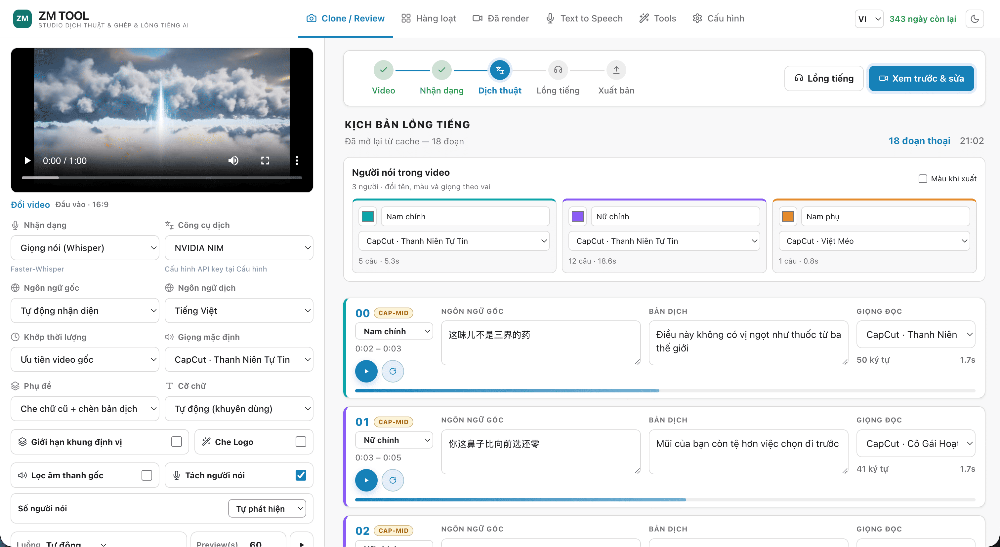
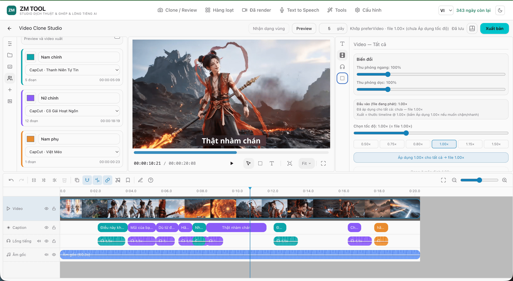
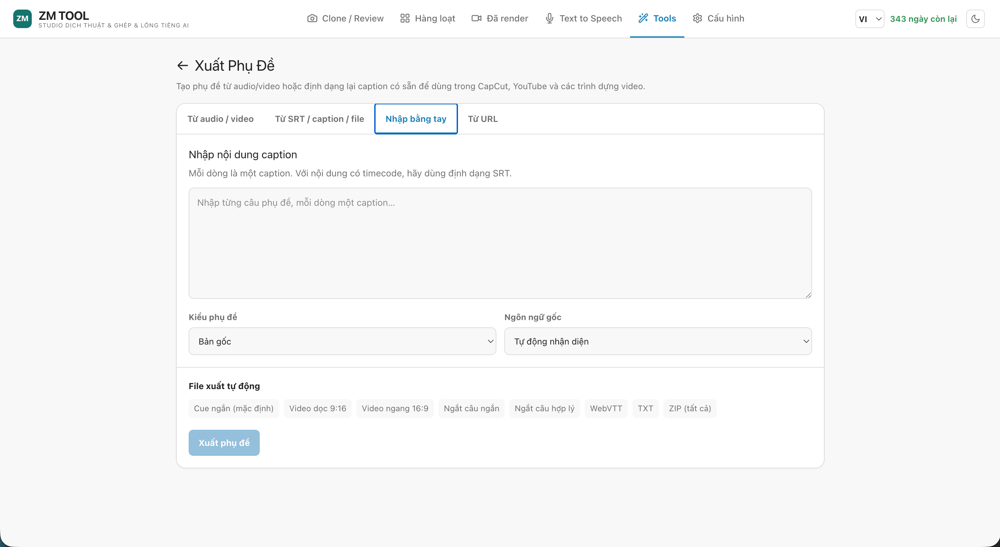
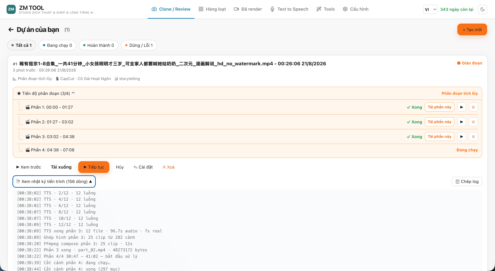
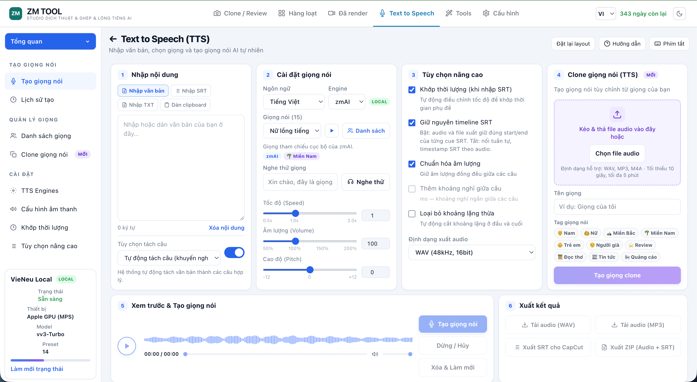
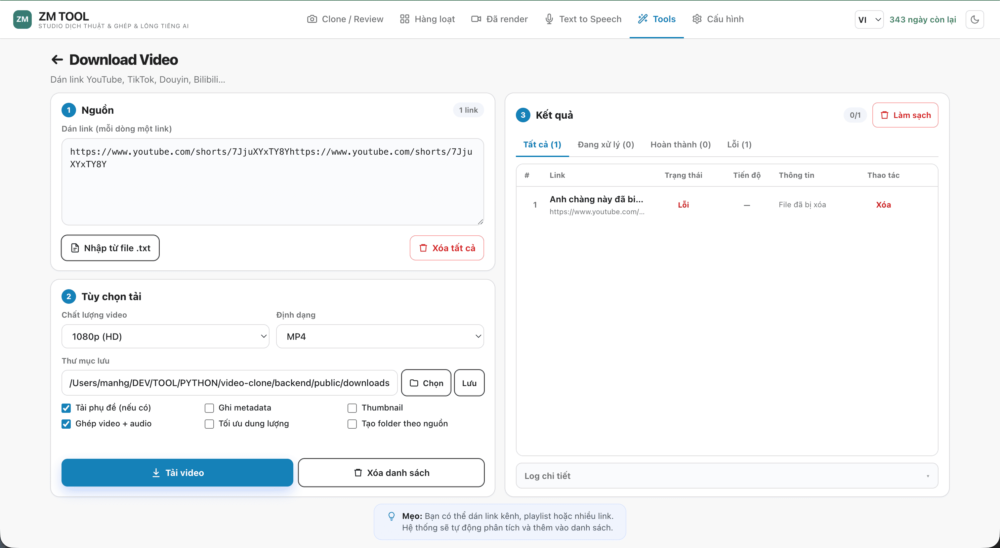
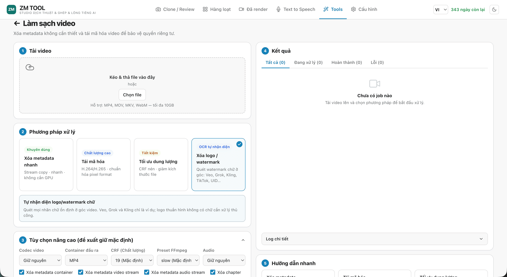
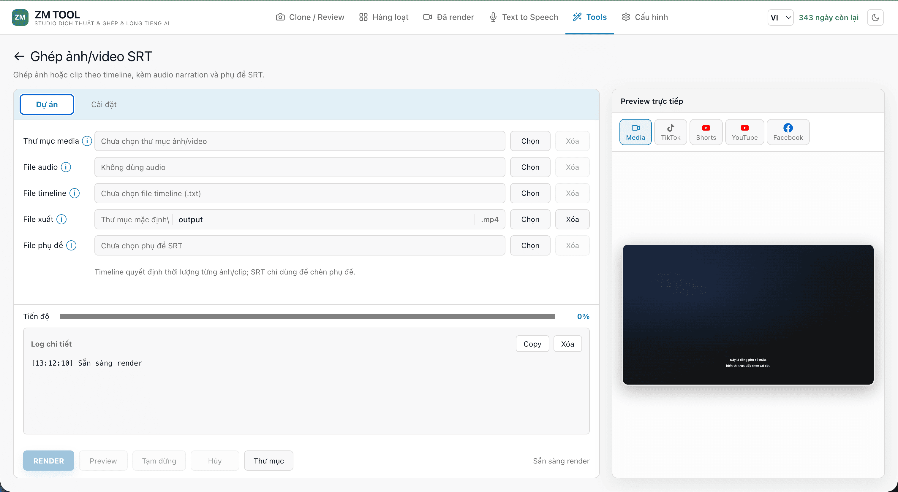
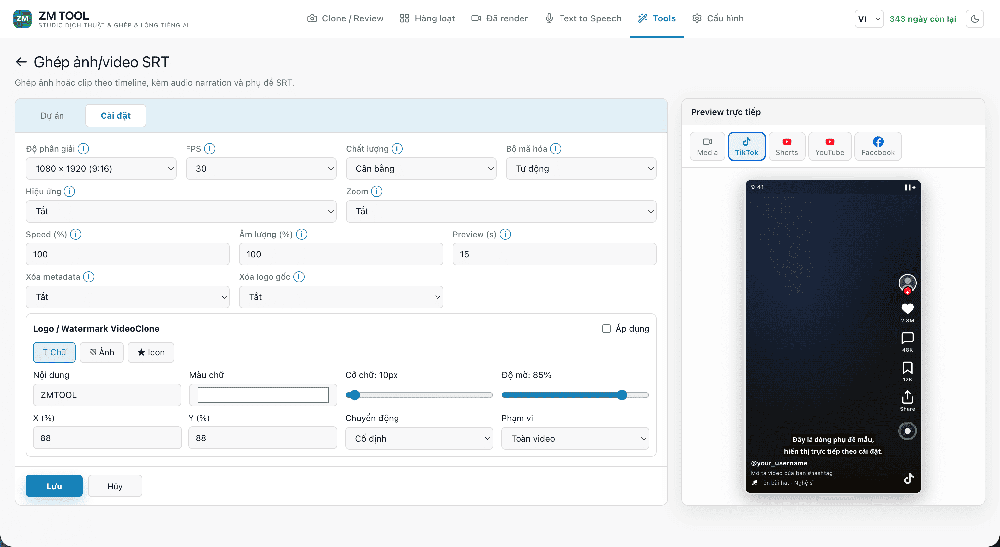
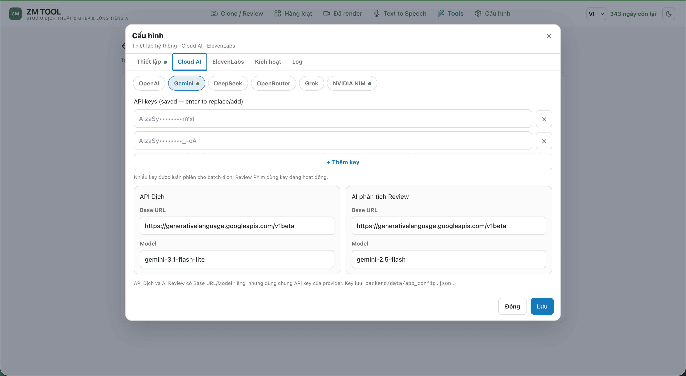

# 🎬 VideoClone (ZM TOOL)

> **Bộ công cụ toàn diện: Tải video, bóc tách phụ đề/giọng nói, dịch thuật AI đa ngữ, nhân bản & lồng tiếng AI, chỉnh sửa timeline trực quan, làm sạch watermark và xuất video chất lượng cao.**

[](package.json)
[](https://www.python.org/)
[](https://nodejs.org/)
[](https://react.dev/)
[](https://fastapi.tiangolo.com/)
[](https://ffmpeg.org/)
[]()
[]()

Ứng dụng hỗ trợ cả **Desktop App (Windows/macOS/Linux)** và **Web App**. Triết lý thiết kế ưu tiên **Local AI an toàn & bảo mật** (chạy Whisper, OCR, VieNeu TTS trên máy nội bộ); chỉ gửi dữ liệu ra ngoài khi người dùng cấu hình sử dụng các API Cloud (OpenAI, Gemini, ElevenLabs, DeepSeek,...).

---

## 📸 Giao diện & Tính năng cốt lõi

### 1. 🎬 Clone Video (Quy trình Dịch & Lồng tiếng AI)
Tự động hóa hoàn toàn luồng xử lý: **Tải video lên → Nhận diện ASR/OCR → Dịch thuật AI → Tinh chỉnh Timeline/Khung che → Lồng tiếng AI → Xuất bản MP4**.
- Nhận diện giọng nói siêu tốc với **Faster-Whisper** hoặc bóc tách hardsub bằng **RapidOCR**.
- Tự động phát hiện và che phủ sub gốc (Smart Bounding Box).
- Tách nhạc nền và giọng gốc bằng **Demucs** để giữ nguyên âm thanh nền sống động.



---

### 2. 🎛️ Live Preview Editor (Biên tập Trực quan Thời gian thực)
Trình chỉnh sửa đa năng chuẩn chuyên nghiệp:
- **Timeline & Waveform**: Xem dạng sóng âm thanh, kéo thả điều chỉnh mốc thời gian từng câu phụ đề.
- **Bounding Box & Layout**: Tùy biến vùng che chữ (`horizontal`, `mid`, `vertical`, `label`), kéo giãn khung che sub linh hoạt.
- **Bake Speed**: Thay đổi tốc độ video trực tiếp trên timeline.



---

### 3. 🎨 Tùy chỉnh Kiểu dáng Phụ đề (Caption Styling)
Bộ công cụ tạo kiểu chữ phong phú, hỗ trợ phông chữ Việt hóa:
- Căn chỉnh vị trí, lề, kích thước font chữ, khoảng cách dòng.
- Đầy đủ hiệu ứng: Màu chữ, viền chữ (Outline/Stroke), đổ bóng (Shadow), nền hộp phụ đề (Box Background).
- Xuất video chuẩn WYSIWYG (nhìn thấy thế nào xuất ra đúng như vậy).



---

### 4. 🍿 Chế độ Review Phim (Film Recap Mode)
Không gian làm việc chuyên biệt dành cho các nhà sáng tạo nội dung **Review Phim / Tóm tắt truyện / Phim tài liệu**:
- Quản lý kịch bản phân cảnh chi tiết, đồng bộ lời bình với từng trích đoạn phim.
- Cắt ghép media, gán giọng đọc AI tự động cho từng đoạn kịch bản.
- Tối ưu hóa tối đa thời gian sản xuất video recap triệu view.



---

### 5. 🎙️ Text to Speech Studio & Voice Cloning
Studio chuyển đổi văn bản và phụ đề thành giọng nói AI:
- Hỗ trợ nhập trực tiếp văn bản hoặc tải lên tệp **SRT**.
- Tích hợp công nghệ **Voice Cloning** (VieNeu): Nhân bản giọng nói bất kỳ chỉ từ 3–10 giây audio mẫu.
- Xuất âm thanh đa định dạng: **WAV, MP3, SRT** hoặc tải trọn gói **ZIP**.



---

### 6. 📥 Tải Video Đa Nền Tảng (Video Downloader)
Tải video nhanh chóng từ hầu hết các mạng xã hội phổ biến:
- Hỗ trợ **YouTube, TikTok, Facebook, Douyin, Bilibili, Kuaishou, X/Twitter,...**
- Hỗ trợ hàng đợi tải nhiều video (Batch Queue).
- Nút bấm 1 chạm đưa video vừa tải sang tab **Clone Video** để xử lý ngay.



---

### 7. 🧹 Làm Sạch Video (Video Cleaner / Watermark Remover)
Công cụ dọn dẹp các yếu tố không mong muốn trên khung hình:
- Tẩy xóa watermark, logo kênh, số điện thoại, icon động hoặc text rác.
- Đa dạng chế độ xử lý: **AI Inpainting, Blur (làm mờ), Solid Color (che màu đồng nhất)**.
- Tùy chọn xóa theo mốc thời gian hoặc áp dụng cho toàn bộ video.



---

### 8. 🎞️ Ghép Video / Ảnh + Audio + SRT (Subtitle & Media Merger)
Tạo video tự động từ danh sách hình ảnh hoặc video ngắn kết hợp với file lồng tiếng và phụ đề:
- Tự động căn chỉnh thời lượng hình ảnh/video khớp từng câu trong file SRT.
- Tùy chỉnh tỉ lệ khung hình (16:9 Youtube, 9:16 TikTok/Reels/Shorts).
- Cài đặt hiệu ứng chuyển cảnh, zoom hình, màu sắc nền chuyên sâu.





---

### 9. ⚡ Cấu hình & Tích hợp Cloud / Local AI (Settings & Cloud Support)
Quản lý toàn diện các kết nối và tài nguyên hệ thống:
- **Cloud LLM Translation**: OpenAI GPT, Google Gemini, Anthropic, xAI Grok, DeepSeek, OpenRouter.
- **Local Translation**: Ollama, Google/TikTok/MyMemory (miễn phí, không cần key).
- **TTS Engines**: VieNeu (Local GPU/CPU & Clone), zmAI, CapCut, ElevenLabs (hỗ trợ xoay vòng nhiều API key), System TTS.
- **Hardware Acceleration**: Quản lý thiết bị tính toán (NVIDIA CUDA, Apple Silicon MPS, CPU), cài đặt tự động môi trường AI độc lập.



---

### 10. 📦 Xử lý hàng loạt (Batch Processing) & Quản lý Video Đã Render
- **Batch Processing**: Nạp danh sách nhiều video, tự động chạy toàn bộ pipeline ASR → Dịch → Dub → Render mà không cần thao tác từng video.
- **Đã Render (Renders Manager)**: Quản lý thư viện video xuất ra, xem thumbnail, phát video, đổi tên, tải xuống hoặc mở thư mục trực tiếp trên máy tính.

---

## 🧠 Hệ thống AI Engines & Tăng tốc phần cứng

| Thành phần | Engine hỗ trợ | Cơ chế tăng tốc / Ghi chú |
|---|---|---|
| **ASR (Nhận diện giọng)** | `faster-whisper` | Tăng tốc **CUDA (ctranslate2)** / Apple **MPS** / CPU đa luồng |
| **OCR (Bóc chữ trên video)** | `RapidOCR` | Tăng tốc **ONNX Runtime GPU** / CPU |
| **Dịch thuật (MT)** | • Miễn phí: Google, TikTok, MyMemory<br>• Local: Ollama<br>• Cloud: OpenAI, Gemini, DeepSeek, Grok, OpenRouter | Cơ chế tự động Fallback: Google → TikTok → MyMemory khi không dùng key |
| **TTS (Lồng tiếng)** | • **VieNeu Local**: Tiếng Việt chuẩn bản xứ, hỗ trợ Clone giọng<br>• **zmAI**: Giọng đọc tối ưu sẵn<br>• **CapCut**: Đa dạng giọng vùng miền/cảm xúc<br>• **ElevenLabs**: Chất lượng studio (hỗ trợ danh sách key `sk_1,sk_2`)<br>• **System**: macOS `say`, Windows SAPI, Linux `espeak-ng` | **VieNeu**: Ưu tiên CUDA → MPS → ONNX CPU.<br>Hỗ trợ tinh chỉnh tốc độ và âm lượng từng câu |
| **Tách nhạc nền (Stem)** | `Demucs` (Hybrid Transformer) | Tách riêng vocal & nhạc nền bằng **CUDA / Apple MLX / CPU** |
| **Mã hóa Video (Export)** | `FFmpeg` | Hỗ trợ tăng tốc phần cứng **NVIDIA NVENC** khi có GPU |

> [!TIP]
> Ứng dụng Desktop **không đóng gói sẵn** các thư viện AI nặng (PyTorch/Whisper) để giảm dung lượng file cài đặt. Lần đầu sử dụng, bạn chỉ cần vào **Cấu hình → Thiết lập** để hệ thống tự động tải và cài đặt vào môi trường runtime an toàn tại `%LOCALAPPDATA%\VideoClone\.venv-runtime`.

---

## 🛠️ Hướng dẫn cài đặt & Chạy từ mã nguồn

### Yêu cầu hệ thống
- **Node.js**: Phiên bản 18+ (khuyên dùng [NVM](https://github.com/nvm-sh/nvm) hoặc [NVM for Windows](https://github.com/coreybutler/nvm-windows))
- **Python**: Phiên bản 3.10 – 3.12 (khuyên dùng **3.12**; script setup tự động kiểm tra và cài đặt qua Homebrew/winget nếu thiếu)
- **FFmpeg & FFprobe**: Đã cài đặt và có trong biến môi trường `PATH`
- **Hệ điều hành**: Windows 10/11, macOS (Intel & Apple Silicon), Linux

### Cài đặt nhanh

```bash
# 1. Clone repository
git clone https://github.com/manhgdev/video-clone.git
cd video-clone

# 2. Khởi tạo môi trường tự động (cài dependencies frontend & backend)
npm run setup

# 3. Khởi chạy toàn bộ hệ thống (Frontend + Backend API)
npm run dev:all
```

Sau khi khởi chạy:
- 🌐 **Giao diện Web UI**: `http://127.0.0.1:5173`
- ⚙️ **Backend API**: `http://127.0.0.1:8787`
- 📖 **Tài liệu API (Swagger UI)**: `http://127.0.0.1:8787/docs`

---

### Danh mục Lệnh Scripts (npm)

| Lệnh | Chức năng |
|---|---|
| `npm run dev:all` | Khởi chạy song song cả Vite Frontend và FastAPI Backend |
| `npm run dev` | Khởi chạy riêng Vite Frontend (`:5173`) |
| `npm run server` | Khởi chạy riêng FastAPI Backend với live reload (`:8787`) |
| `npm run build` | Kiểm tra kiểu TypeScript (`tsc`) và đóng gói Frontend bundle |
| `npm run test:i18n` | Kiểm tra tính nhất quán của hệ thống đa ngôn ngữ (VI/EN) |
| `npm run build:app` | Đóng gói ứng dụng Desktop chạy độc lập qua PyInstaller |

---

### Cấu hình file `.env` (Tùy chọn)

Sao chép `backend/.env.example` thành `backend/.env` để cấu hình sẵn các API Key hoặc tham số nâng cao:

```env
# Cloud AI API Keys (hoặc nhập trực tiếp tại giao diện Cấu hình)
OPENAI_API_KEY=sk-...
GEMINI_API_KEY=...
DEEPSEEK_API_KEY=...
GROK_API_KEY=...
OPENROUTER_API_KEY=...
ELEVENLABS_API_KEYS=sk_key1,sk_key2,sk_key3

# Cấu hình thiết bị phần cứng & backend VieNeu
# VIENEU_BACKEND=auto          # auto | pytorch | onnx | cpu
# VIDEOCLONE_TORCH_DEVICE=     # cuda | mps | cpu
```

---

## 📦 Đóng gói Desktop (Windows Desktop Release)

Dự án tích hợp sẵn quy trình đóng gói ứng dụng Desktop hoàn chỉnh qua `build_app/`:

```bash
npm run build:app
```

- **Thư mục đầu ra**: `build_app/release/VideoClone_v<version>/`
- **Cách chạy**: Khởi chạy file `VideoClone.exe` **bên trong thư mục xuất ra** (không di chuyển riêng file `.exe` ra ngoài).
- **Tùy chọn nâng cao**:
  - `$env:ONEFILE='1'; npm run build:app` : Đóng gói 1 file duy nhất.
  - `$env:CLEAN='1'; npm run build:app` : Xóa toàn bộ cache build cũ trước khi đóng gói.

### Quy tắc đánh Version (SemVer)
VideoClone tuân thủ nghiêm ngặt chuẩn 3 số `major.minor.patch` (từ `0` đến `9`):
- `3.0.0` → `3.0.1` (Tăng bản vá thông thường).
- `3.0.9` → `3.1.0` (Cuộn sang minor mới).
- `2.9.9` → `3.0.0` (Cuộn sang major mới).
- Script tự động đồng bộ version giữa `package.json`, `build_app/VERSION`, tiêu đề ứng dụng và file nén ZIP phát hành.

---

## 🗄️ Cấu trúc Lưu trữ Dữ liệu

| Chế độ | Đường dẫn lưu trữ |
|---|---|
| **Chạy từ mã nguồn** | `backend/public/<project_id>/` (chứa video gốc, audio tách, kết quả xuất) |
| **Dữ liệu giọng Clone** | `backend/data/voices/vieneu/` (chứa audio mẫu và embedding giọng) |
| **Desktop Windows** | `%LOCALAPPDATA%\VideoClone` (chứa dữ liệu projects, renders và gói AI Runtime) |

---

## 🔌 Danh mục API Chính (Backend REST Endpoints)

Hệ thống cung cấp hệ thống REST API phong phú tại `http://127.0.0.1:8787`:

| Phương thức | Endpoint | Mô tả |
|---|---|---|
| `POST` | `/api/upload` | Tải lên video mới và khởi tạo project |
| `POST` | `/api/projects/{id}/run` | Chạy tiến trình nhận diện ASR / OCR và dịch thuật |
| `POST` | `/api/projects/{id}/dub` | Thực hiện lồng tiếng AI cho các câu phụ đề |
| `POST` | `/api/projects/{id}/export` | Xuất video MP4 (burn sub, che sub cũ, mux âm thanh) |
| `POST` | `/api/projects/{id}/cancel` | Hủy job đang chạy (kill toàn bộ cây tiến trình FFmpeg/AI) |
| `GET` | `/api/projects/{id}/status` | Truy vấn trạng thái và tiến độ xử lý thời gian thực |
| `GET` / `PUT` | `/api/projects/{id}/segments` | Lấy danh sách hoặc cập nhật nội dung/timing phụ đề |
| `POST` | `/api/projects/{id}/rebake-speed` | Cập nhật lại tốc độ video và remap timeline |
| `POST` | `/api/tts/studio/synthesize` | Tổng hợp âm thanh từ văn bản / SRT trong TTS Studio |
| `POST` | `/api/tts/studio/clone` | Tạo mẫu giọng đọc mới từ audio tải lên |
| `POST` | `/api/cleaner/clean` | Chạy tác vụ tẩy watermark / làm sạch video |
| `POST` | `/api/srt-image/render` | Ghép hình ảnh / video với âm thanh và file SRT |
| `GET` | `/api/renders` | Lấy danh sách toàn bộ video đã render thành công |
| `POST` | `/api/download` | Tạo tác vụ tải video từ URL mạng xã hội |
| `GET` | `/api/system/hardware` | Lấy thông tin chi tiết CPU, RAM, GPU phần cứng |
| `GET` | `/api/system/checks` | Kiểm tra tình trạng các module và gói AI trong hệ thống |

> Xem tài liệu schema chi tiết tại: `http://127.0.0.1:8787/docs` khi backend đang chạy.

---

## 📂 Sơ đồ Cấu trúc Source Code

```text
video-clone/
├── frontend/src/            # Mã nguồn Frontend (React 19 + TypeScript + Vite)
│   ├── app/                 # Shell, router mode, quản lý session, i18n
│   ├── pages/               # Các trang giao diện (Clone, Film, Batch, TTS, Cleaner,...)
│   ├── features/            # Module tính năng (editor, download, cleaner, tts, project,...)
│   └── shared/              # UI components, layout, icons, api client dùng chung
├── backend/                 # Mã nguồn Backend (FastAPI + Python)
│   ├── api/                 # FastAPI router theo domain và middleware
│   ├── pipeline/            # Pipeline xử lý (ASR, OCR, Translation, TTS, Export, Mux, Demucs)
│   ├── core/                # Quản lý phần cứng, tiến trình huỷ an toàn, tài nguyên
│   └── public/              # Thư mục chứa dữ liệu runtime của các dự án
├── previews/                # Ảnh chụp màn hình giao diện thực tế của ứng dụng
├── tests/                   # Bộ kiểm thử tự động (backend pytest & frontend i18n tests)
├── scripts/                 # Scripts tự động hóa khởi tạo và phát triển (setup, dev)
└── build_app/               # Cấu hình đóng gói ứng dụng Desktop (PyInstaller launcher)
```

> Chi tiết về quy tắc phụ thuộc và phân chia trách nhiệm module được mô tả tại **[STRUCTURE.md](STRUCTURE.md)**.

---

## 🌐 Trải nghiệm Người dùng & Đa ngôn ngữ (i18n)

- **Hỗ trợ Song ngữ toàn diện**: Chuyển đổi linh hoạt giữa **Tiếng Việt (VI)** và **Tiếng Anh (EN)** trực tiếp trên thanh điều hướng. Mọi thông báo, nhãn, hướng dẫn đều được bản địa hóa.
- **Chế độ Giao diện**: Hỗ trợ chuyển đổi nhanh giữa giao diện **Tối (Dark Mode)** và **Sáng (Light Mode)**.
- **Quản lý Tiến trình An toàn**: Nút **Hủy (Đỏ/X)** cho phép dừng tức thì công việc đang chạy và dọn dẹp sạch sẽ tài nguyên phần cứng (kill process tree). Nút **Chạy nền** cho phép thu nhỏ popup để tiếp tục thao tác các tính năng khác trong khi job vẫn đang xử lý.

---

## 🛡️ Giới hạn & Khuyến nghị

1. **Hiệu năng nhận diện (OCR & Whisper)**: Độ chính xác của OCR phụ thuộc vào độ sắc nét và kích thước chữ trên video gốc. Đối với video dài hoặc máy cấu hình vừa phải, khuyến nghị dùng model `small`/`medium` hoặc model `ONNX`.
2. **Dịch thuật & Lồng tiếng**: Khuyến nghị kiểm tra lại nội dung bản dịch và timing trên Live Preview Editor trước khi bấm xuất bản cuối cùng để đạt chất lượng tốt nhất.
3. **Các dịch vụ Cloud bên thứ ba**: Google, TikTok, CapCut là các dịch vụ bên ngoài có thể bị giới hạn tần suất (rate-limit). Đối với khối lượng công việc lớn, nên cấu hình sử dụng API Key chuyên dụng (OpenAI, Gemini, ElevenLabs,...).

---

## 📄 License & Bản quyền

Dự án phát triển bởi **manhgdev**. Mọi quyền được bảo lưu.
Phục vụ mục đích nghiên cứu, sáng tạo nội dung và phát triển công cụ tự động hóa video.
